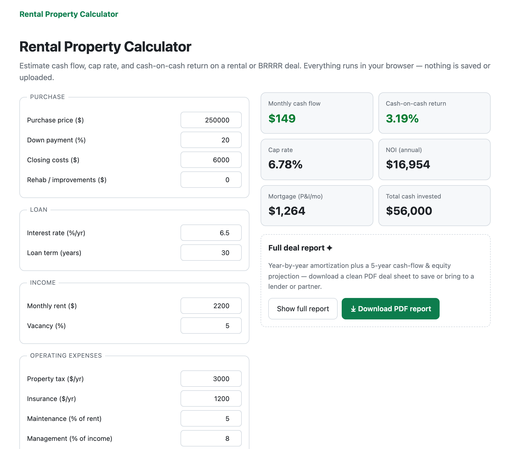

# Rental Property Calculator

A free, private calculator for analyzing a rental or BRRRR deal: monthly cash flow, cap rate, cash-on-cash return, NOI, and mortgage payment — updated live as you type.

**▶ Use it: https://myastroapp.github.io/rental-calculator/**

## What it computes
- **Monthly & annual cash flow** after mortgage and operating expenses
- **Cap rate** (NOI ÷ price) and **cash-on-cash return** (cash flow ÷ cash invested)
- **NOI**, mortgage **P&I**, and total cash invested
- A one-time Pro unlock downloads a professional **PDF deal report** — all metrics, a **5-year cash-flow / equity projection**, and **year-by-year amortization** — to save or bring to a lender or partner

## Privacy
Everything runs locally in your browser. No accounts, no tracking, nothing uploaded. The figures you enter never leave your device.

Estimates only — verify with your lender and a local agent before making an offer.

## More free tools
- [JSON & developer tools](https://myastroapp.github.io/json-viewer/) — viewer, formatter, converters, JWT, Base64, regex, and more
- [Invoice / estimate / receipt generator](https://myastroapp.github.io/invoice-generator/) — free, no sign-up
- [Resume builder + cover letter + ATS checker](https://myastroapp.github.io/resume-builder/) — free, private
